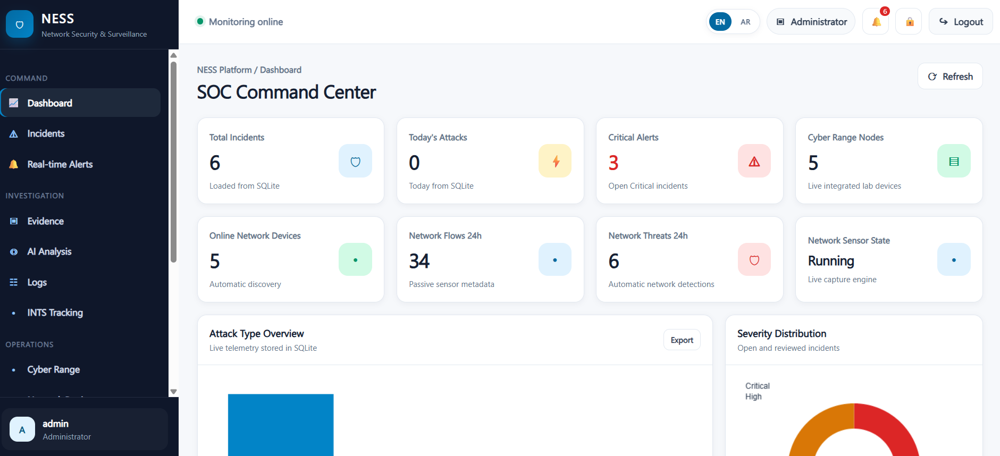
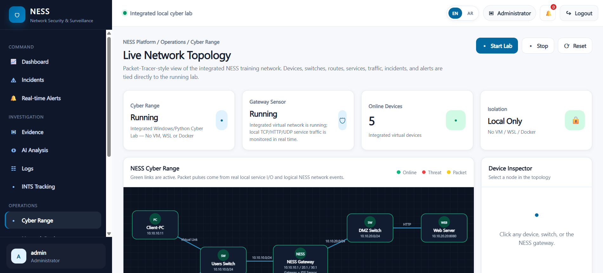
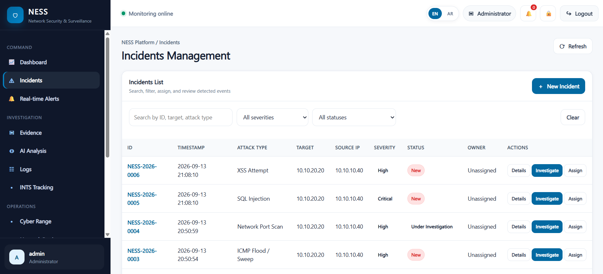
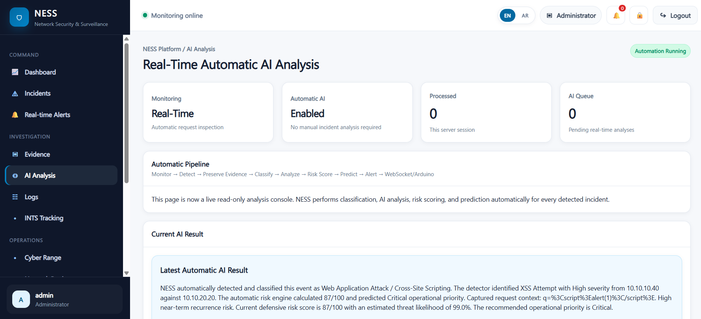
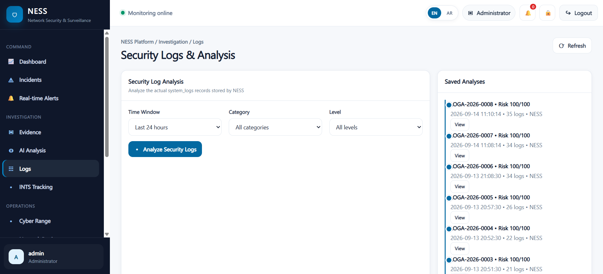
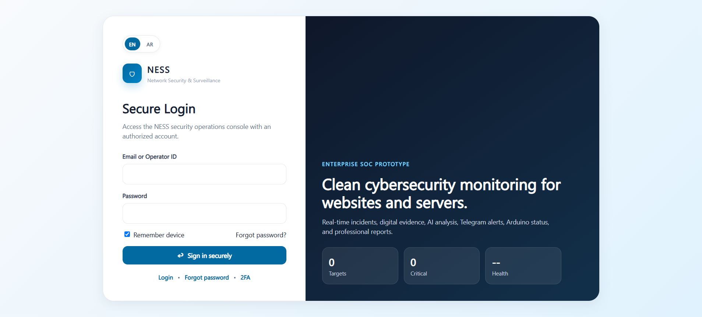
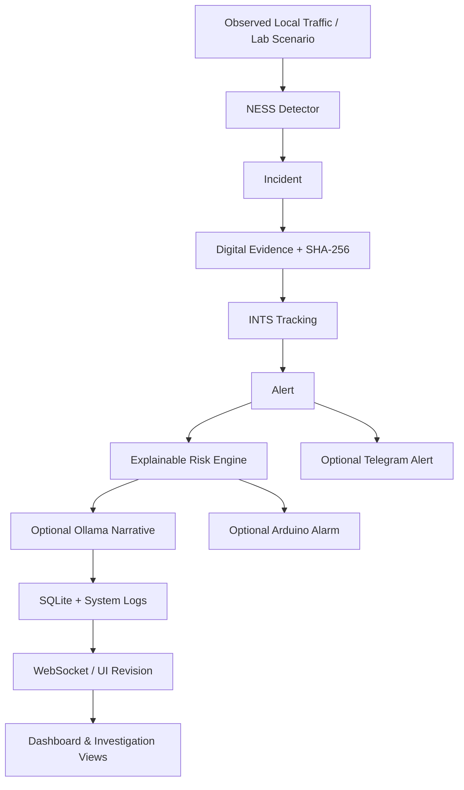

# NESS — Network Security & Surveillance System

> A defensive cybersecurity monitoring and incident-response platform with a built-in isolated cyber range, real-time event propagation, digital evidence preservation, explainable risk analysis, reporting, and optional Arduino/Telegram alerts.

[](https://python.org)
[](https://flask.palletsprojects.com)
[](https://sqlite.org)
[](https://developer.mozilla.org/en-US/docs/Web/API/WebSockets_API)
[](https://github.com/Abdulrahman-Alsebaeai)

## Overview

NESS is a full-stack defensive security project focused on **monitoring, detection, investigation, and response workflows**. It combines a Flask backend, SQLite persistence, a multi-page SOC-style interface, passive request/network detectors, an isolated local cyber-range simulator, SHA-256 evidence preservation, incident/alert tracking, explainable risk scoring, optional local LLM enrichment through Ollama, live WebSocket updates, PDF reporting, and optional physical Arduino alarms.

The integrated cyber range is deliberately constrained to local training traffic. Its logical `10.10.x.x` topology is modeled inside the application while HTTP/TCP/UDP services are bound to local sockets, making the demonstration practical without requiring WSL, VMs, Docker, Npcap, or kernel-level network namespaces.

## Highlights

- SOC dashboard with incidents, alerts, evidence, logs, INTS tracking, reports, users, roles, and settings.
- Defensive detection for SQL injection, XSS, directory traversal, authentication bursts, request-rate anomalies, port scans, host sweeps, SYN-flood patterns, and ICMP anomalies.
- Automatic incident pipeline: detection → incident → evidence → SHA-256 hash → INTS → alert → risk analysis → logs → live UI update.
- Built-in isolated cyber range with a visual network topology and repeatable training scenarios.
- WebSocket push plus lightweight revision polling for resilient real-time UI refresh.
- Explainable local hybrid risk engine; optional Ollama narrative analysis can be layered on top.
- Role-based page/API permissions for administrators, operators, and analysts.
- PDF incident reports and investigation history.
- Optional Telegram notifications and Arduino LED/buzzer alert integration.
- Arabic/English interface with RTL/LTR support.

## Screenshots

### SOC Dashboard


### Cyber Range / Network Topology


<details>
<summary>More screenshots</summary>






</details>

## Security Data Flow



## Technology Stack

| Layer | Technology |
|---|---|
| Backend | Python, Flask, Werkzeug |
| Live updates | `flask-sock` WebSocket |
| Database | SQLite |
| Frontend | HTML, CSS, JavaScript |
| Detection | Defensive regex/rate/network heuristics |
| Risk analysis | Explainable local hybrid risk scoring |
| Optional AI | Ollama local LLM |
| Reporting | ReportLab PDF |
| Hardware | Arduino over serial (`pyserial`) |
| Notifications | Telegram Bot API (optional) |

## Quick Start

### Requirements

- Python 3.10+ recommended
- Windows, Linux, or macOS
- Arduino is optional
- Ollama is optional

### Windows

```bat
run_windows.bat
```

### Linux / macOS

```bash
python -m venv .venv
source .venv/bin/activate
pip install -r requirements.txt
cp .env.example .env
python app.py
```

Then open `http://127.0.0.1:5000`. On a new database, complete the initial administrator setup from the application.

## Configuration

Copy `.env.example` to `.env`. Important options include:

```env
FLASK_SECRET_KEY=
NESS_DB_PATH=data/ness.sqlite3
TELEGRAM_BOT_TOKEN=
TELEGRAM_CHAT_ID=
ARDUINO_ENABLED=false
ARDUINO_PORT=AUTO
OLLAMA_ENABLED=false
OLLAMA_MODEL=llama3.1:8b
LAB_ENABLED=true
LAB_AUTO_START=true
```

Never commit the real `.env` file.

## Cyber Range Safety Model

The built-in lab is intended for controlled local demonstration and defensive education. Scenarios are constrained to the local application environment and do not require or automatically target external hosts. The logical network addresses shown in the topology are application-level training identities; they are not independent kernel network namespaces.

Included scenarios cover normal connectivity plus safe local demonstrations of SQLi/XSS/traversal signatures, authentication bursts, port-scan-like activity, ICMP bursts, and host sweeps.

## Project Structure

```text
app.py                 # Flask application and API routes
ness_core/             # Detection, DB, risk, lab, reporting, Arduino, realtime services
frontend/              # SOC-style web interface
arduino/               # Arduino alert firmware
lab/                    # Supporting lab utilities/docs
scripts/                # Self-check and safe demo scripts
data/                   # Runtime SQLite database (ignored)
reports/                # Generated PDF reports (ignored)
docs/screenshots/       # Portfolio screenshots
```

## Validation

The Python source in the supplied project passes `python -m compileall`. The repository also includes `scripts/project_self_check.py` for dependency, SQLite, cyber-range, and bilingual UI checks.

```bash
python scripts/project_self_check.py
```

## Documentation

The repository includes detailed Arabic implementation notes, including:

- [`README_AR.md`](README_AR.md)
- [`CYBER_RANGE_ARCHITECTURE_AR.md`](CYBER_RANGE_ARCHITECTURE_AR.md)
- [`FULL_REALTIME_INTEGRATION_AR.md`](FULL_REALTIME_INTEGRATION_AR.md)
- [`BILINGUAL_SUPPORT_AR.md`](BILINGUAL_SUPPORT_AR.md)

## Author

**Abdulrahman Al-Sebaeai** — Computer Science / Cybersecurity & Software Projects  
GitHub: [@Abdulrahman-Alsebaeai](https://github.com/Abdulrahman-Alsebaeai)

## License

Copyright © 2026 Abdulrahman Al-Sebaeai. All rights reserved. See [`LICENSE`](LICENSE).
